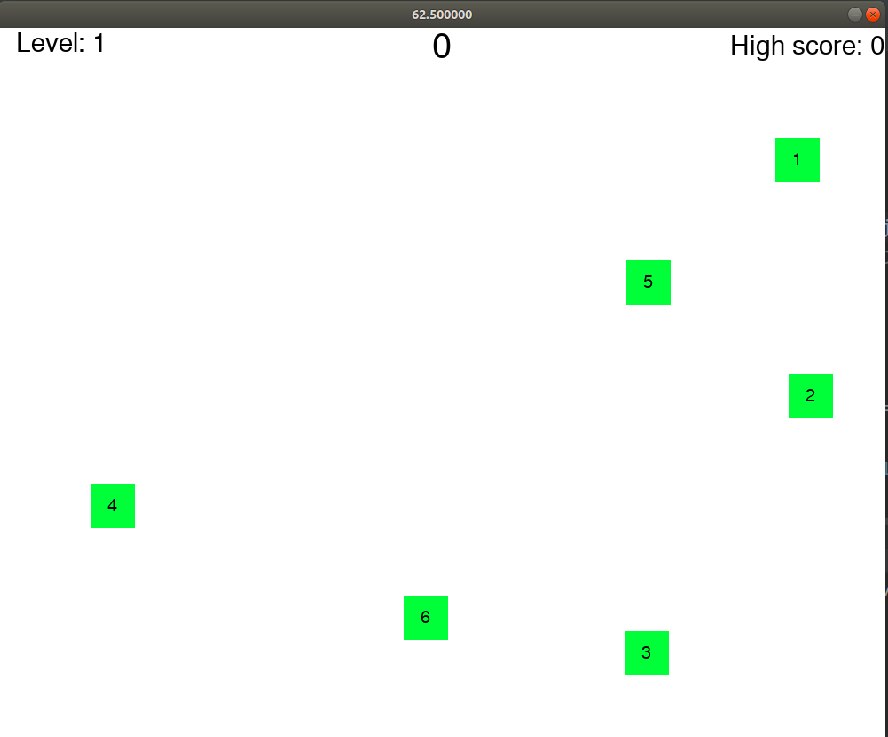
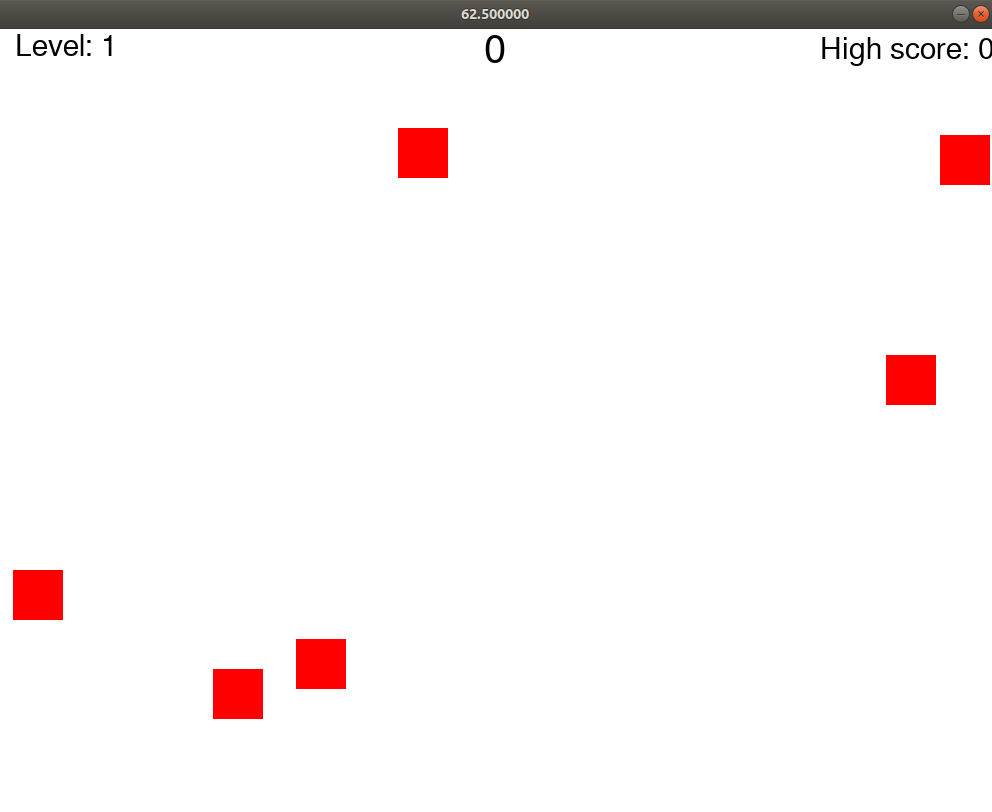

# The Memorise Game
A memorise game inspired by Giovanni Gato, from Reddit






## Prerequisites

```bash
pip install pygame
```

## How to start

Simply run the following command

```bash
python main.py
```

## Authors

[porfinogeneta](https://github.com/porfinogeneta)

## Credits

Inspired by the game form this YT [video](https://youtu.be/UzNEYP9YG2M)

Project backbone inspired by [KidsCanCode](https://www.youtube.com/c/KidscancodeOrg/videos)

## Licence

